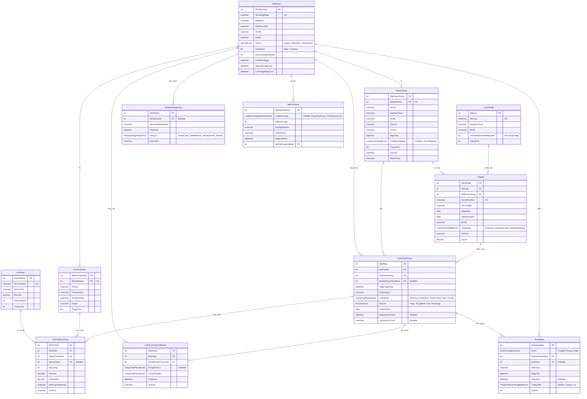

```mermaid
erDiagram
    %% QUAN HE CAC BANG
    LoaiThietBi ||--o{ ThietBi : "phan_loai"
    KhachHang ||--o{ ThietBi : "so_huu"
    TaiKhoan ||--o| KhachHang : "la"
    TaiKhoan ||--o| KyThuatVien : "la"
    ThietBi ||--o{ PhieuSuaChua : "duoc_sua"
    KhachHang ||--o{ PhieuSuaChua : "tao"
    TaiKhoan ||--o{ PhieuSuaChua : "tiep_nhan"
    PhieuSuaChua ||--o{ ChiTietSuaChua : "bao_gom"
    KyThuatVien ||--o{ ChiTietSuaChua : "thuc_hien"
    LinhKien ||--o{ ChiTietSuaChua : "su_dung"
    PhieuSuaChua ||--o{ LichSuTrangThaiPhieu : "ghi_nhan"
    TaiKhoan ||--o{ LichSuTrangThaiPhieu : "thay_doi"
    TaiKhoan ||--o{ NhatKyDangNhap : "ghi_nhan"
    TaiKhoan ||--o{ TepDinhKem : "tai_len"
    TaiKhoan ||--o{ ThongBao : "nhan"
    PhieuSuaChua ||--o{ ThongBao : "lien_quan"

    %% CHI TIET CAC BANG
    TaiKhoan {
        int MaTaiKhoan PK
        nvarchar TenDangNhap "UK"
        nvarchar MatKhau
        nvarchar MatKhauSalt
        nvarchar HoTen
        nvarchar Email
        VaiTroEnum VaiTro "Admin, NhanVien, KhachHang"
        bit TrangThai "false = bi khoa"
        int SoLanDangNhapSai
        datetime KhoaDenNgay
        datetime NgayTaoTaiKhoan
        datetime LanDangNhapCuoi
    }

    NhatKyDangNhap {
        int MaNhatKy PK
        int MaTaiKhoan FK "Nullable"
        nvarchar TenDangNhapNhap
        datetime ThoiGian
        KetQuaDangNhapEnum KetQua "ThanhCong, SaiMatKhau, KhongTonTai, BiKhoa"
        nvarchar DiaChiIP
    }

    LoaiThietBi {
        int MaLoai PK
        nvarchar TenLoai "UK"
        nvarchar HangSanXuat
        nvarchar MoTa
        int ThoiHanBaoHanhMacDinh "tinh bang thang"
        bit TrangThai
    }

    KhachHang {
        int MaKhachHang PK
        int MaTaiKhoan FK "UK"
        nvarchar HoTen
        nvarchar SoDienThoai
        nvarchar Email
        nvarchar DiaChi
        nvarchar CCCD
        datetime NgayTao
        LoaiKhachHangEnum LoaiKhachHang "CaNhan, DoanhNghiep"
        bit TrangThai
        nvarchar GhiChu
        nvarchar MaSoThue
    }

    ThietBi {
        int MaThietBi PK
        int MaLoai FK
        int MaKhachHang FK
        nvarchar SerialNumber "UK"
        nvarchar TenThietBi
        date NgayMua
        date HanBaoHanh
        nvarchar MoTa
        TrangThaiThietBiEnum TrangThai "KhaDung, DangSuaChua, KhongKhaDung"
        nvarchar GhiChu
        decimal GiaTri
    }

    KyThuatVien {
        int MaKyThuatVien PK
        int MaTaiKhoan FK "UK"
        nvarchar HoTen
        nvarchar ChuyenMon
        nvarchar SoDienThoai
        nvarchar Email
        bit TrangThai
    }

    PhieuSuaChua {
        int MaPhieu PK
        int MaThietBi FK
        int MaKhachHang FK
        int MaTaiKhoanTiepNhan FK "Nullable"
        datetime NgayTiepNhan
        nvarchar NoiDungLoi
        TrangThaiPhieuEnum TrangThai "ChoXuLy, DangXuLy, HoanThanh, Huy, TuChoi"
        MucDoEnum MucDo "Thap, TrungBinh, Cao, KhanCap"
        date HanDuKien
        datetime NgayHoanThanh "Nullable"
        nvarchar LyDoHuyTuChoi "Nullable"
    }

    LichSuTrangThaiPhieu {
        int MaLichSu PK
        int MaPhieu FK
        int MaTaiKhoanThucHien FK
        TrangThaiPhieuEnum TrangThaiCu "Nullable"
        TrangThaiPhieuEnum TrangThaiMoi
        datetime ThoiGian
        nvarchar GhiChu
    }

    LinhKien {
        int MaLinhKien PK
        nvarchar TenLinhKien "UK"
        nvarchar DonViTinh
        decimal DonGia
        int SoLuongTon
        bit TrangThai
    }

    ChiTietSuaChua {
        int MaChiTiet PK
        int MaPhieu FK
        int MaKyThuatVien FK
        int MaLinhKien FK "Nullable"
        int SoLuong
        decimal DonGia
        decimal ThanhTien
        nvarchar KetQuaChanDoan
        nvarchar GhiChu
    }

    TepDinhKem {
        int MaTepDinhKem PK
        LoaiDoiTuongDinhKemEnum LoaiDoiTuong "ThietBi, PhieuSuaChua, ChiTietSuaChua"
        int MaDoiTuong
        nvarchar DuongDanFile
        nvarchar TenFileGoc
        datetime NgayUpload
        int MaTaiKhoanUpload FK
    }

    ThongBao {
        int MaThongBao PK
        KenhThongBaoEnum Kenh "TrongHeThong, Email"
        int MaTaiKhoanNhan FK
        int MaPhieu FK "Nullable"
        nvarchar NoiDung
        datetime NgayTao
        datetime NgayGui "Nullable"
        TrangThaiGuiThongBaoEnum TrangThai "ChoGui, DaGui, Loi"
        bit DaDoc
    }
```
